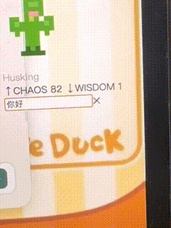
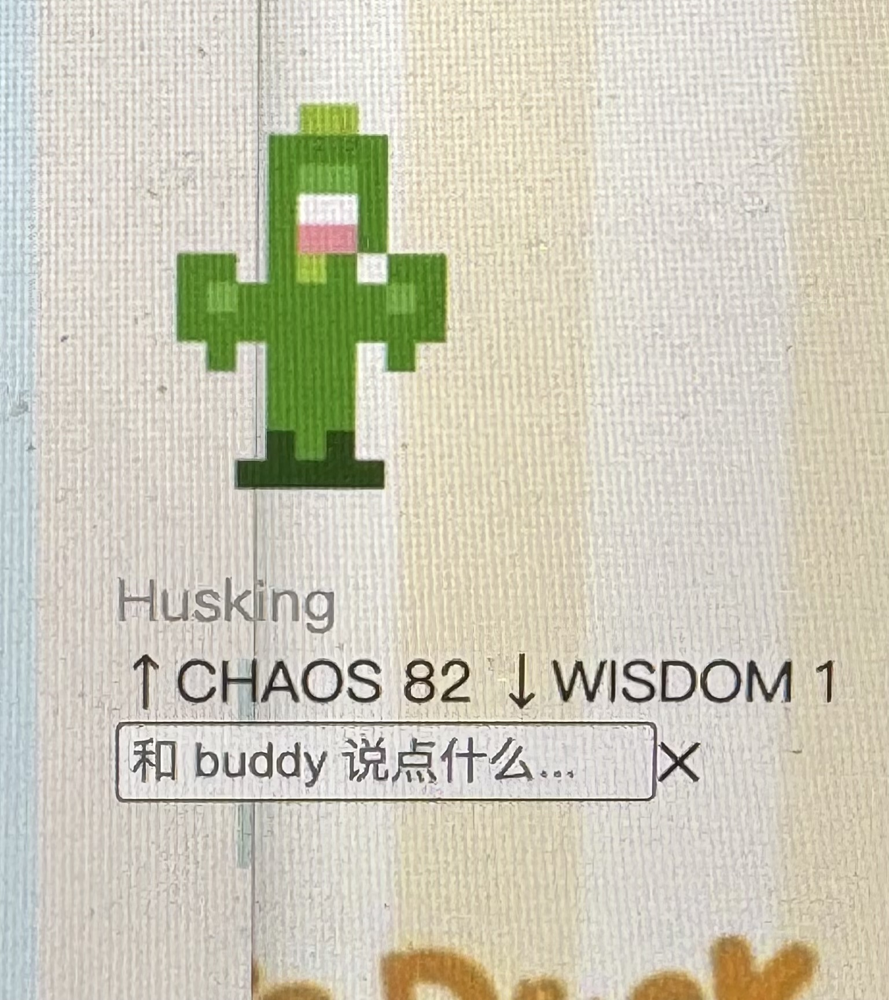

# buddy-shelter

**你用 any-buddy 换了新 buddy，但原来那只也想留着。**  
*You swapped to a new buddy with any-buddy — but the original one wanted to stay.*

buddy-shelter forks [any-buddy](https://github.com/cpaczek/any-buddy) and adds: an automatic backup of your original Claude Code companion, a desktop pet window, and a **mirror mode** that syncs the pet with your live Claude Code session in real time.

---

## Features / 功能

| | |
|---|---|
| 🗄️ **原始 buddy 自动备份** | 每次运行前静默写入 `~/.buddy-shelter/original.json`，后悔的路永远开着 |
| 🖥️ **桌宠双模式** | ASCII 终端风格 · 像素精灵风格，右键随时切换 |
| 💬 **AI 对话** | 接入 Claude Sonnet 4.6，buddy 用自己的性格和属性值回复 |
| 📵 **离线降级** | 无 API key 时自动用预设语句池，不报错不卡顿 |
| ⏰ **定时唠叨** | 每 15–30 分钟随机冒一句话（按属性条件筛选） |
| ↩️ **完全向后兼容** | any-buddy 所有原有命令不变，buddy-shelter 是超集 |
| 🪞 **镜像模式** | `buddy-shelter mirror` 包裹 `claude`，buddy 在桌宠里实时说话 |

---

## Screenshots / 截图





---

## Installation / 安装

```bash
# 1. 克隆仓库 / Clone
git clone https://github.com/yankehang0-beep/any-buddy buddy-shelter
cd buddy-shelter

# 2. 安装 CLI 依赖 / Install CLI deps
pnpm install   # or npm install

# 3. 安装桌宠 Electron 依赖（仅桌宠功能需要）
#    Install Electron deps (only needed for the desktop pet)
cd desktop && npm install && cd ..

# 4. 全局链接（可选）/ Link globally (optional)
npm link
```

---

## Usage / 使用

### CLI 命令

```bash
# ── any-buddy 原有命令（完全不变）/ Original any-buddy commands (unchanged) ──
any-buddy                        # 交互式选宠 / Interactive pet picker
any-buddy --species cactus -r epic -y
any-buddy preview                # 预览，不应用 / Preview without applying
any-buddy current                # 查看当前宠物 / Show current pet
any-buddy apply                  # 重新应用已保存配置 / Re-apply saved config
any-buddy restore                # 恢复原始 salt / Restore original salt
any-buddy rehatch                # 删除 companion，重新孵化 / Re-hatch companion

# ── buddy-shelter 新增命令 / New commands ──
buddy-shelter                    # 运行主流程（自动备份）/ Main flow (auto-backup)
buddy-shelter original           # 查看备份的原始 buddy / Show backed-up original
buddy-shelter summon             # 启动桌宠窗口（显示原始 buddy）/ Launch desktop pet (original buddy)
buddy-shelter dismiss            # 关闭桌宠窗口 / Close desktop pet
buddy-shelter mirror             # 镜像模式：包裹 claude，宠物实时同步 / Mirror mode: wrap claude, pet syncs live
```

### 对话 / Chat

```bash
export ANTHROPIC_API_KEY=sk-ant-...
buddy-shelter summon
# 点击桌宠 → 输入框弹出 → Enter 发送
# Click the pet → input box appears → Enter to send
```

无 API key 时自动降级为预设语句，完全正常使用。  
*Without an API key the pet falls back to offline preset phrases — no errors.*

### 数据文件 / Data files

| Path | Content |
|---|---|
| `~/.buddy-shelter/original.json`    | 原始 buddy 完整数据（bones + soul） |
| `~/.buddy-shelter/mirror-current.json` | 镜像模式：当前 buddy 快照 |
| `~/.buddy-shelter/mirror.port`      | 镜像模式：WS 服务器端口（进程退出后删除） |
| `~/.buddy-shelter/config.json`      | 桌宠偏好（模式、窗口位置） |
| `~/.buddy-shelter/app.log`          | 桌宠运行日志（调试用） |

---

## How It Works

buddy-shelter hooks into `runInteractive` and recomputes your original buddy's full bones using the Mulberry32 PRNG (same algorithm as Claude Code, seeded with `userId + 'friend-2026-401'`). It reads the companion soul (name, personality) from `~/.claude.json`. **This data is always saved silently, regardless of what the user chooses next.** The normal any-buddy flow then proceeds unchanged.

The desktop pet is an independent Electron process — transparent, frameless, always-on-top — and has no effect on Claude Code's operation.

---

## Development

```
buddy-shelter/
├── bin/cli.mjs              # CLI entry (extends any-buddy)
├── lib/
│   ├── shelter.mjs          # Original buddy backup / read
│   └── tui.mjs              # summon / dismiss / original commands
├── desktop/                 # Electron desktop pet
│   ├── main.js              # Main process (window, tray, API, idle timer)
│   ├── preload.js           # IPC bridge
│   └── renderer/
│       ├── index.html
│       ├── app.js           # Render logic (dual mode + bubble + input)
│       ├── sprites.js       # ASCII sprite data
│       └── pixel-sprites.js # Pixel sprite data (from buddy-reveal)
└── package.json
```

---

## Acknowledgements / 致谢

- Fork of [cpaczek/any-buddy](https://github.com/cpaczek/any-buddy) — MIT License
- Pixel sprite system inspired by [yankehang0-beep/buddy-reveal](https://github.com/yankehang0-beep/buddy-reveal)
- Built on [Claude Code](https://claude.ai/code)'s companion system

---

## License

MIT — same as the original any-buddy.
